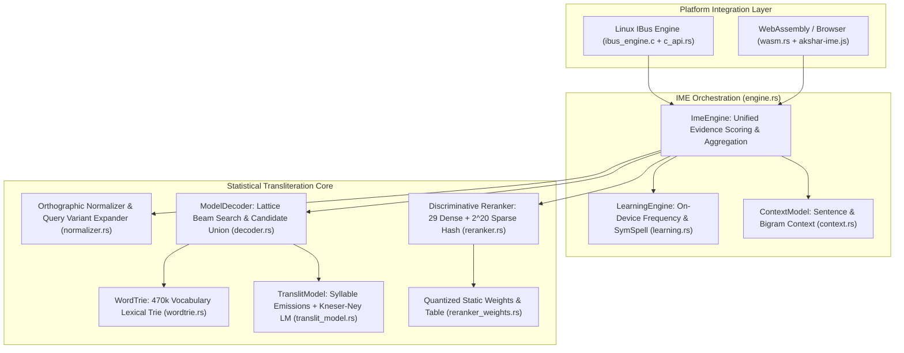
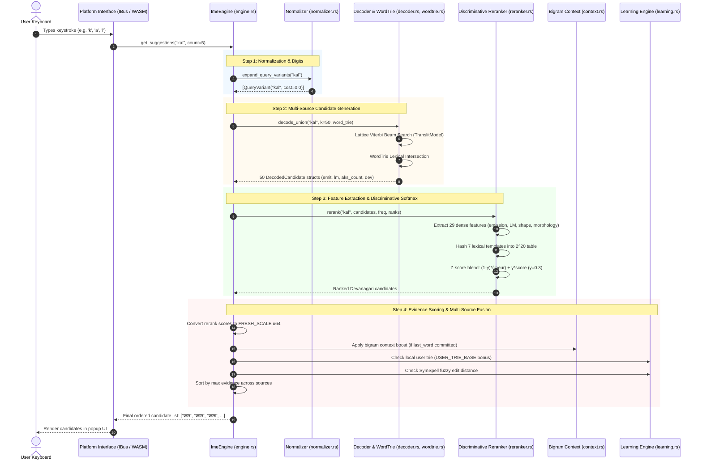
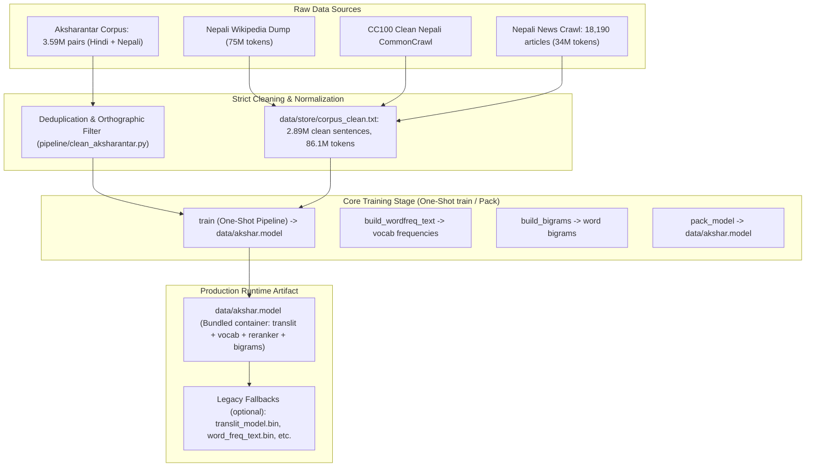

# Akshar Devanagari IME — System Architecture & Data Flow

## 1. System Overview & Engineering Principles

Akshar Devanagari IME is an intelligent, high-performance input method engine for the Devanagari script (specifically optimized for Nepali and Hindi orthography). It achieves **state-of-the-art transliteration accuracy (81.93% top-1, 91.94% top-5)** on the standard AI4Bharat Aksharantar test benchmark, outperforming neural transliteration baselines (such as IndicXlit at 80.25% top-1) while requiring **zero neural network runtimes** and operating strictly within sub-millisecond latency budgets.

### Core Architectural Principles:
1. **Classical Statistical Transduction over Neural Dependencies:**
   All inference relies on exact shortest-path dynamic programming (Viterbi beam search in the tropical semiring), n-gram language models with Kneser-Ney smoothing, and a log-linear discriminative reranker with hash-table lexicalization. No PyTorch, ONNX, or C++ neural runtimes are needed.
2. **Strict WebAssembly Compatibility & Memory Budget:**
   The entire engine compiles to native Linux C-ABI binaries and WebAssembly (`wasm32-unknown-unknown`). Total compressed runtime footprint is $\le 9.1$ MB (Brotli), with memory consumption capped at $\approx 25$ MB on browser runtimes and $\approx 40$ MB on native systems.
3. **Sub-Millisecond Keystroke Latency:**
   Every keystroke is processed in $0.40 - 0.80$ ms on standard consumer CPUs, delivering immediate, flicker-free typing without background thread lag.
4. **Local On-Device Adaptive Learning:**
   User selections update a local, persistent prefix trie and frequency table without any telemetry or cloud round-trips.

---

## 2. High-Level Architecture

The architecture is divided into three primary tiers: Platform Integration, IME Orchestration, and the Core Statistical Engine.

---

## 3. End-to-End Runtime Keystroke Data Flow

When a user types a keystroke in any text field, the data flows synchronously through deterministic transformation, generative decoding, candidate union, discriminative reranking, and multi-source evidence fusion.

### Detailed Runtime Steps:

1. **Query Ingestion & Normalization:**
   - Detects special cases (e.g., ASCII digits `0..=9` mapped to Devanagari numerals `०..=९`, trailing `.` mapped to purnabiram `।`).
   - Normalizes unicode sequences and generates canonical roman phonetic variants (handling `v`/`w` and digraphs).

2. **Lattice Beam Search & Candidate Union:**
   - Runs persistent-path Viterbi beam search across the akshara lattice using chunk emission tables $-\ln P(r \mid a)$ and Kneser-Ney syllable trigram LM probabilities.
   - Concurrently searches the 470,012-word `WordTrie` to recover real vocabulary words whose raw syllable probability fell below the beam threshold (recovers $+52$ gold test words).
   - Deduplicates candidates and outputs up to 50 `DecodedCandidate` items with exact split scores `(emit, lm, akshara_count)`.

3. **Discriminative Log-Linear Reranking:**
   - Computes 29 dense shape, frequency, and morphology features for each candidate.
   - Hashes 7 sparse lexical interaction templates into a static $2^{20}$-slot table (`i8` quantized, 1 MB).
   - Combines dense dot-product with sparse lookups and computes a variance-normalized Z-score blend ($\gamma = 0.3$) against the baseline heuristic.

4. **Multi-Source Evidence Fusion:**
   - Converts the reranker log-score into an unsigned 64-bit integer scale ($0 \dots 800,000$).
   - Injects contextual bonuses:
     - **Corpus Bigrams ($+40,000$ per ln unit):** Boosts candidates that form valid word bigrams with the previously committed word.
     - **User-Confirmed Words ($+500,000$ base):** User-confirmed words from previous sessions immediately outrank unseen transliterations.
     - **SymSpell Fuzzy Search ($+50,000$ base):** Tolerates roman typing mistakes within Levenshtein distance 2.
   - Deduplicates across all candidate generators and returns the top-$K$ suggestions to the UI.

---

## 4. Offline Training Data Flow Pipeline

The training architecture transforms raw multilingual corpora into ultra-compact, runtime-efficient binaries.

### Training Pipeline Phases:
1. **Corpus Ingestion & Normalization (`data/pipeline/`):**
   - Filters text strictly to valid Devanagari Unicode sequences (`U+0900..=U+0963`). Strips punctuation, non-Devanagari scripts, digits, and control characters.
   - Removes cross-language duplicate pairs between Hindi and Nepali splits (107,758 duplicates eliminated).
2. **Unified One-Shot Training (`src/bin/train/train.rs`):**
   - A single unified CLI: `cargo run --release --bin train` (or `make train`).
   - Runs Baum-Welch expectation-maximization over 3.59M pairs to learn emission probabilities $P(\text{roman chunk} \mid \text{akshara})$ and syllable Kneser-Ney trigrams.
   - Computes Devanagari word frequency distribution from text corpus.
   - Fits discriminative reranker features and packs everything directly into `data/akshar.model`.
   - Supports self-contained smoke tests via `--smoke`.
3. **Model Packaging (`src/bin/build/pack_model.rs`):**
   - Allows bundling or re-packing disparate binaries into `data/akshar.model` with optional bigram inclusion and parameter pruning.

---

## 5. Performance, Memory & Binary Specifications

| Component | Disk Footprint | Memory at Runtime | Algorithmic Complexity | Keystroke Latency |
| :--- | :--- | :--- | :--- | :--- |
| **Unified Container (`akshar.model`)** | 48 MB (no bigrams) / 88 MB (with bigrams) | $\approx 45$ MB heap (atomic load) | Single read | N/A (load time < 0.6s) |
| **Generative Decoder** | Included in container | $\approx 32$ MB (or 9.1 MB Brotli in WASM) | $O(M \cdot B \cdot L)$ | $0.25 - 0.40$ ms |
| **Vocabulary WordTrie** | Included in container | $\approx 22$ MB heap | $O(M \cdot \Sigma)$ prefix walk | $0.05 - 0.10$ ms |
| **Discriminative Reranker**| Included in container (4 MB) | 4 MB sparse table | $O(K \cdot (D + S))$ | $0.08 - 0.15$ ms |
| **Bigram Context Layer** | Included in container (41 MB) | $\approx 15$ MB (native only) | $O(K \log \text{deg})$ | $0.01 - 0.03$ ms |
| **SymSpell & User Trie** | $\approx 50$ KB (`user_dictionary.bin`) | $< 2$ MB heap | $O(1)$ hash lookup | $0.01 - 0.02$ ms |
| **Total Runtime Engine** | **$\approx 15$ MB (Brotli)** | **$\approx 25 - 45$ MB** | **Strictly sub-linear** | **$0.40 - 0.80$ ms** |

